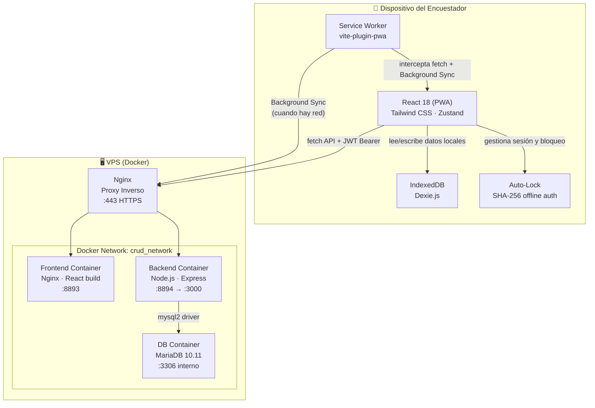
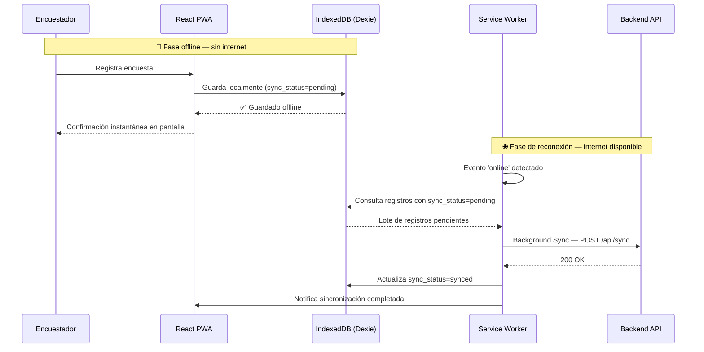
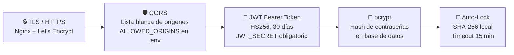
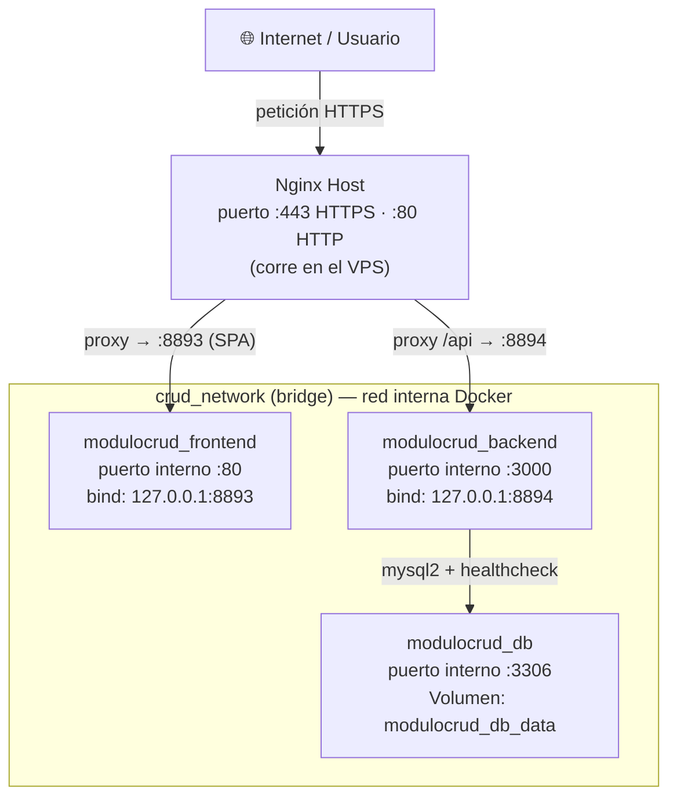

# 🏗️ Arquitectura y Componentes — Módulo CRUD

Este documento valida visualmente la arquitectura implementada, mostrando los componentes,
sus responsabilidades y cómo se relacionan entre sí.

---

## Diagrama de Componentes

---

## Responsabilidades por Componente

| Componente | Tecnología | Responsabilidad principal |
|---|---|---|
| **React PWA** | React 18, Vite | UI, formularios, navegación, estado global |
| **Zustand Store** | Zustand | Estado global: sesión, lock, conectividad |
| **IndexedDB** | Dexie.js | Persistencia local offline de encuestas y datos |
| **Service Worker** | vite-plugin-pwa | Caché de assets, Background Sync, instalabilidad |
| **Auto-Lock** | JS nativo + SHA-256 | Bloqueo por inactividad (15min), auth offline |
| **Nginx Proxy** | Nginx | Terminación TLS, enrutamiento `/api` vs SPA |
| **Express API** | Node.js + Express | Endpoints REST, validación, lógica de negocio |
| **JWT Middleware** | jsonwebtoken | Autenticación de rutas protegidas vía Bearer token |
| **Motor de Sync** | Node.js scripts | Merge de lotes offline, Healing Script de estadísticas |
| **MariaDB** | MariaDB 10.11 | Persistencia centralizada, fuente de verdad |

---

## Flujo Offline-First

---

## Capas de Seguridad

---

## Estructura de Contenedores Docker

> Los puertos están bindeados a `127.0.0.1` (no `0.0.0.0`), por lo que solo
> Nginx del host puede acceder a los contenedores — nunca expuestos directamente a internet.
