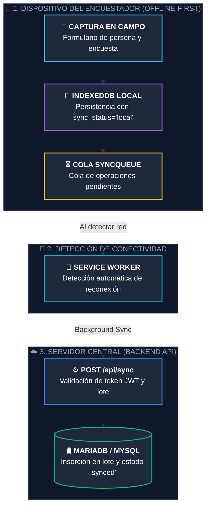

# Documentación y Especificación de Requisitos del Sistema

## 1. Descripción general del sistema
El Sistema CRUD de Encuestas es una aplicación web progresiva (PWA) diseñada para capturar, gestionar y consultar datos de personas encuestadas. El sistema opera en modo offline-first, garantizando disponibilidad total sin conexión a internet, y sincroniza los datos de forma automática cuando se restablece la conectividad.

**Decisión arquitectónica clave — ¿Por qué PWA y no Android nativo?**
Una PWA permite una única base de código que funciona en navegador web y se instala como APK en Android (mediante TWA — Trusted Web Activity). Esto elimina la necesidad de mantener dos proyectos separados, reduce el tiempo de desarrollo y garantiza que ambas plataformas siempre estén sincronizadas.

### 1.1 Objetivos del sistema
* Capturar encuestas/datos de personas con o sin conexión a internet.
* Gestionar contactos con lógica de rotación de prioridad (nuevo contacto → posición 1).
* Funcionar como aplicación instalable en Android y como sitio web.
* Exportar datos a CSV/Excel para análisis externo.
* Sincronizar datos locales al servidor cuando haya conectividad disponible.

### 1.2 Requisitos no funcionales
| Requisito | Descripción | Prioridad |
|-----------|-------------|-----------|
| Disponibilidad offline | 100% funcional sin internet (lectura y escritura) | Alta |
| Instalable como APK | Via TWA/Bubblewrap en Android 5+ | Alta |
| Tiempo de carga | Primera carga < 3s en red 3G | Media |
| Sincronización | Automática al recuperar conexión | Media |
| Compatibilidad | Chrome 80+, Firefox 75+, Edge 80+ | Alta |
| Seguridad | HTTPS obligatorio para Service Worker | Alta |

## 2. Arquitectura general — PWA Offline-First
### 2.1 Patrón arquitectónico
El sistema adopta el patrón Offline-First combinado con MVVM (Model-View-ViewModel) para la organización del código. Esto significa que la aplicación siempre lee y escribe primero en la base de datos local (IndexedDB), y delega la sincronización con el servidor a un proceso en segundo plano.

| Capa | Patrón | Responsabilidad |
|------|--------|-----------------|
| Presentación | Componentes React | Renderizado de UI, formularios, navegación |
| Estado | MVVM con Zustand | Estado global, lógica de negocio, validación |
| Datos locales | Repository Pattern | Abstracción sobre IndexedDB via Dexie.js |
| Sincronización | Sync Queue | Cola de operaciones pendientes para el servidor |
| Offline | Service Worker | Cache de assets, interceptación de red |

### 2.2 Flujo de datos offline-first

| **1. Captura en Campo** | `IndexedDB (Dexie.js)` | El encuestador llena el formulario sin internet; los datos se guardan al instante en el navegador/app con `sync_status = 'local'`. |
| **2. Detección de Red** | `Service Worker` | Monitorea el estado de conectividad en segundo plano; al recuperar señal de red, activa el proceso de sincronización. |
| **3. Servidor Central** | `Express API + MySQL` | Recibe el lote mediante `POST /api/sync`, valida el token JWT, inserta las encuestas en MySQL y actualiza el estado a `synced`. |

El flujo de operaciones garantiza que el sistema nunca bloquea al usuario por falta de conexión:
1. Usuario realiza una acción (crear, editar, eliminar registro).
2. La acción se escribe inmediatamente en IndexedDB (respuesta instantánea).
3. Si hay internet: la operación se envía también al servidor en tiempo real.
4. Si no hay internet: la operación se agrega a una cola de sincronización (SyncQueue).
5. El Service Worker detecta cuando se restaura la conexión y procesa la cola automáticamente.

**Garantía de integridad:**
Cada registro incluye un campo `sync_status` con valores: `'local'` (pendiente de subir al servidor), `'synced'` (sincronizado con el servidor) o `'deleted'` (pendiente de eliminación física en el servidor). El campo `updated_at` permite resolver conflictos de concurrencia a favor del dato más reciente.

## 3. Stack tecnológico
### 3.1 Frontend — Capa de presentación
| Tecnología | Versión | Rol en el sistema | Justificación |
|------------|---------|-------------------|---------------|
| React | 18.x | Framework de componentes UI | Ecosistema maduro, hooks, rendimiento con Virtual DOM |
| Vite | 5.x | Bundler y servidor | Rápido, plugin PWA oficial |
| vite-plugin-pwa | 0.19.x | Generación Service Worker | Integra Workbox, genera manifest automáticamente |
| Tailwind CSS | 3.x | Framework de estilos | Clases utilitarias, responsive por defecto |
| React Router | 6.x | Navegación SPA | Navegación sin recarga de página |

### 3.2 Lógica y estado
| Tecnología | Versión | Rol en el sistema | Justificación |
|------------|---------|-------------------|---------------|
| Zustand | 4.x | Estado global | Más simple que Redux, sin boilerplate |
| React Hook Form | 7.x | Gestión de formularios | Validación eficiente |

### 3.3 Capa de datos (offline)
| Tecnología | Versión | Rol en el sistema | Justificación |
|------------|---------|-------------------|---------------|
| IndexedDB | Nativa | Base de datos | API estándar del navegador para datos estructurados offline |
| Dexie.js | 3.x | ORM sobre IndexedDB | API similar a SQL con soporte transaccional |

### 3.4 Sincronización y backend
| Tecnología | Versión | Rol en el sistema | Justificación |
|------------|---------|-------------------|---------------|
| Custom SyncManager | Nativo | Sincronización proactiva | Sincronización Push/Pull con Debounce para mitigar latencia |
| Fetch API | Nativa | Llamadas HTTP | Comunicación ligera y nativa con API REST |
| Node.js + Express | 20.x | Backend API REST | Servidor central (API y Sync Queue processor) |
| MySQL (mysql2) | 3.x | Base de Datos Central | Relacional, despliegue dockerizado |
| CSV Nativo | Nativo | Exportación CSV | Conversión a Blob sin dependencias externas |

## 4. Estructura del proyecto
La organización de carpetas sigue el patrón feature-based (por funcionalidad). *(Ver repositorio para la estructura del código base).*

## 5. Modelo de datos — IndexedDB y MySQL
El modelo normaliza los contactos en una tabla independiente, eliminando las columnas fijas.

### Tabla: personas
| Campo | Tipo | Restricción | Descripción |
|-------|------|-------------|-------------|
| id | number | PK auto | Identificador único |
| cc | string | UNIQUE, NOT NULL | Cédula de ciudadanía |
| nombres | string | NOT NULL | Nombres |
| apellidos | string | NOT NULL | Apellidos |
| fecha_registro | string | NOT NULL | Fecha de encuesta (ISO 8601) |
| profesion | string | NULL | Profesión u ocupación |
| sync_status | string | DEFAULT 'local' | Estado: 'local', 'synced', 'conflict' |
| created_at | string | NOT NULL | Timestamp de creación |
| updated_at | string | NOT NULL | Timestamp de modificación |

### Tabla: contactos
| Campo | Tipo | Restricción | Descripción |
|-------|------|-------------|-------------|
| id | number | PK auto | Identificador único |
| persona_id | number | FK -> personas.id | Referencia a la persona |
| tipo | string | NOT NULL | 'telefono', 'celular', 'email' |
| valor | string | NOT NULL | Número o dirección |
| prioridad | number | NOT NULL (1-3) | Orden (1 = principal) |
| activo | boolean | DEFAULT true | Vigencia |
| created_at | string | NOT NULL | Timestamp de creación |

### Tabla: encuestas
| Campo | Tipo | Restricción | Descripción |
|-------|------|-------------|-------------|
| id | number | PK auto | Identificador único |
| persona_id | number | FK -> personas.id | Persona encuestada |
| fecha | string | NOT NULL | Fecha de aplicación |
| encuestador | string | NOT NULL | Nombre del encuestador |
| notas | string | NULL | Observaciones |
| sync_status | string | DEFAULT 'local' | Estado sincronización |
| created_at | string | NOT NULL | Timestamp de creación |

### Tabla: encuestadores
| Campo | Tipo | Restricción | Descripción |
|-------|------|-------------|-------------|
| id | number | PK auto | Identificador único |
| nombre | string | UNIQUE, NOT NULL | Nombre del encuestador |
| activo | boolean | DEFAULT true | Si puede ser seleccionado en la app |

### Tabla: usuarios (Admin)
| Campo | Tipo | Restricción | Descripción |
|-------|------|-------------|-------------|
| id | number | PK auto | Identificador único |
| username | string | UNIQUE, NOT NULL | Nombre de usuario (ej. admin) |
| password_hash | string | NOT NULL | Hash Bcrypt de la contraseña |

### 5.2 Lógica inteligente de rotación de contactos
1. Se detecta si el nuevo número ya existe en el perfil de la persona.
2. Si **ya existe**: se promueve a `prioridad = 1` y los demás contactos se desplazan hacia abajo. Si estaba inactivo, se reactiva como principal.
3. Si es **nuevo**: el nuevo toma `prioridad = 1`.
4. Los contactos anteriores se desplazan (1 pasa a 2, 2 pasa a 3).
5. Si ya había 3 activos, el que era de prioridad 3 pasa a inactivo (`activo = false`).
